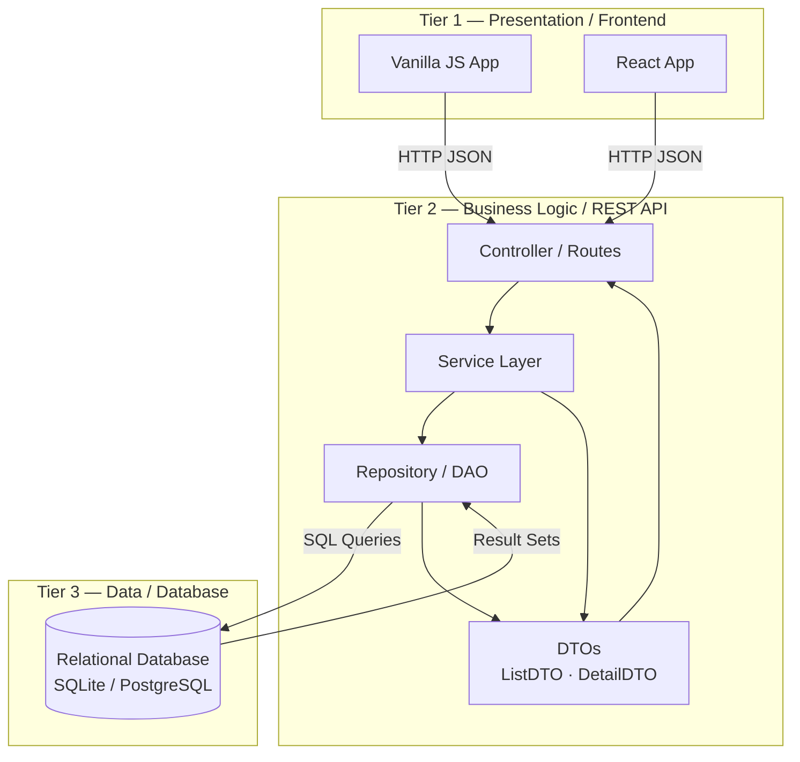
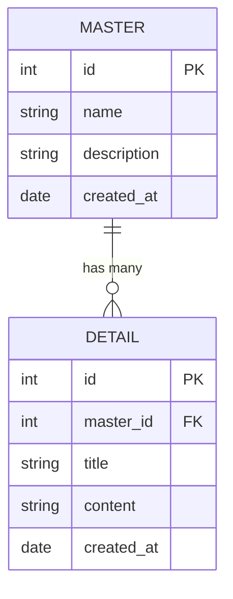
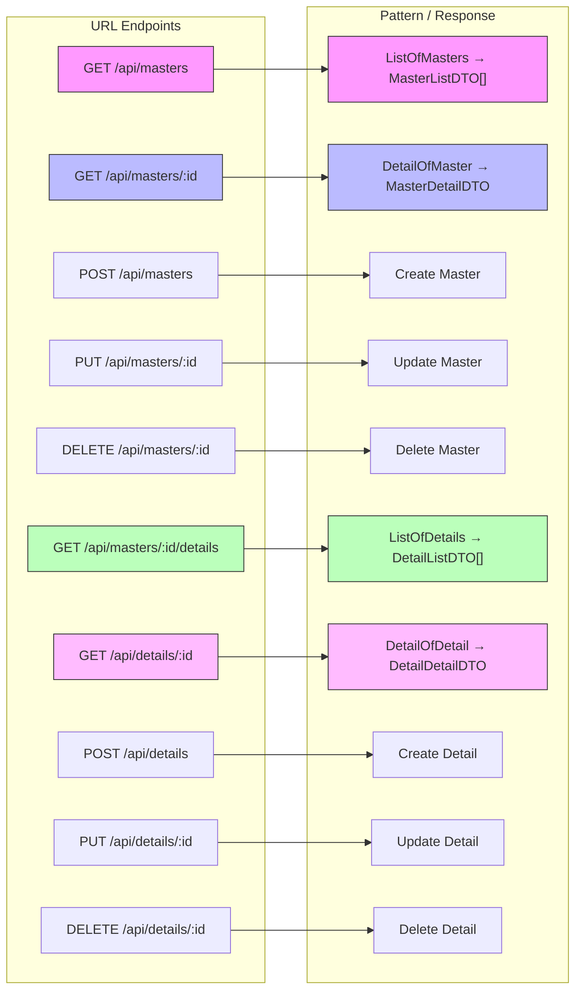
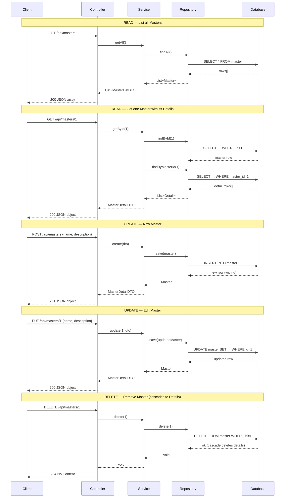
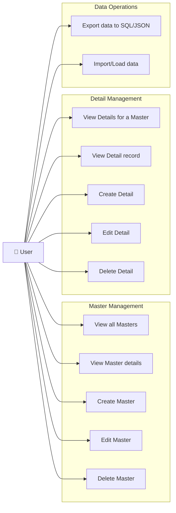
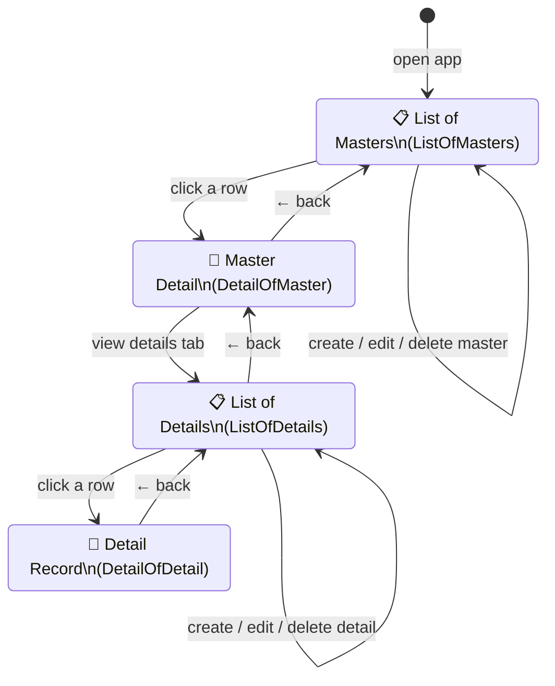
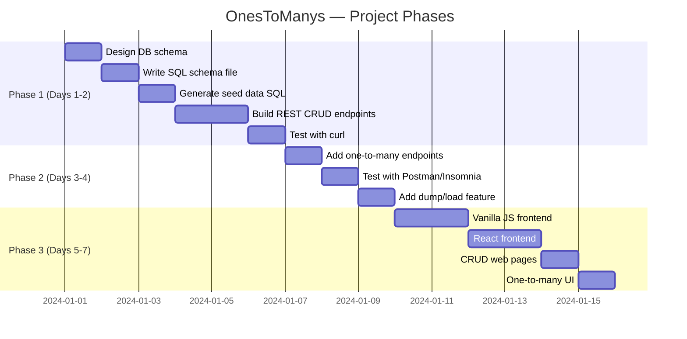

# OnesToManys — UML Diagrams

This file contains UML diagrams (written in [Mermaid](https://mermaid.js.org/)) that describe the architecture and design of the **OnesToManys (ListDetails)** 3-tier web application.

---

## 1. System Architecture — 3-Tier Component Diagram

Shows how the three tiers (Frontend, REST API, Database) relate to each other.



---

## 2. Entity-Relationship (ER) Diagram

Database schema showing the one-to-many relationship between the **Master** table and the **Detail** table.



> Replace `MASTER` / `DETAIL` with your chosen relation (e.g. **Course** / **Student**, **Playlist** / **Song**, etc.).

---

## 3. Class Diagram

Shows the application layers: Entity classes, DTOs, Repository, Service, and Controller.

```mermaid
classDiagram
    direction TB

    %% Entity classes (mapped to DB tables)
    class Master {
        +int id
        +String name
        +String description
        +Date createdAt
        +List~Detail~ details
    }

    class Detail {
        +int id
        +int masterId
        +String title
        +String content
        +Date createdAt
        +Master master
    }

    Master "1" --> "0..*" Detail : contains

    %% Data Transfer Objects
    class MasterListDTO {
        +int id
        +String name
        +String description
    }

    class MasterDetailDTO {
        +int id
        +String name
        +String description
        +Date createdAt
        +List~DetailListDTO~ details
    }

    class DetailListDTO {
        +int id
        +String title
    }

    class DetailDetailDTO {
        +int id
        +String title
        +String content
        +Date createdAt
        +int masterId
    }

    MasterDetailDTO *-- DetailListDTO

    %% Repository layer
    class MasterRepository {
        +findAll() List~Master~
        +findById(id) Master
        +save(master) Master
        +delete(id) void
    }

    class DetailRepository {
        +findAll() List~Detail~
        +findById(id) Detail
        +findByMasterId(masterId) List~Detail~
        +save(detail) Detail
        +delete(id) void
    }

    %% Service layer
    class MasterService {
        +getAll() List~MasterListDTO~
        +getById(id) MasterDetailDTO
        +create(dto) MasterDetailDTO
        +update(id, dto) MasterDetailDTO
        +delete(id) void
        +getDetails(masterId) List~DetailListDTO~
    }

    class DetailService {
        +getAll() List~DetailListDTO~
        +getById(id) DetailDetailDTO
        +create(dto) DetailDetailDTO
        +update(id, dto) DetailDetailDTO
        +delete(id) void
    }

    MasterService --> MasterRepository
    MasterService --> DetailRepository
    DetailService --> DetailRepository

    %% Controller layer
    class MasterController {
        +GET  /masters
        +GET  /masters/{id}
        +POST /masters
        +PUT  /masters/{id}
        +DELETE /masters/{id}
        +GET  /masters/{id}/details
    }

    class DetailController {
        +GET  /details
        +GET  /details/{id}
        +POST /details
        +PUT  /details/{id}
        +DELETE /details/{id}
    }

    MasterController --> MasterService
    DetailController --> DetailService
```

---

## 4. REST API Endpoint Map

Maps each URL pattern to its ListOf / DetailView role and HTTP method.



---

## 5. Sequence Diagram — Full CRUD Flow

Shows the request/response lifecycle for each CRUD operation across all three tiers.



---

## 6. Use Case Diagram

Shows what a **User** can do with the application.



---

## 7. UI Navigation Flow

Shows how a user navigates through the web interface across the four view types.



---

## 8. Phase Milestone Timeline


